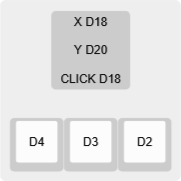

# ZMK ANU Layout Firmware

[Hardware repository](https://github.com/aroum/ANU)

# Analog stick
Currently, only button support is implemented. ZMK does not yet have built-in support for ADC. However, there is a [third-party implementation](https://github.com/badjeff/zmk-analog-input-driver) that you can try using.

# Pins 

